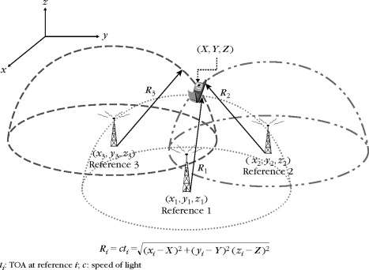

# WiFi Triangulation for Device Location

The method you are referring to is often called "WiFi triangulation" or "WiFi positioning." This technique leverages the signal strength of WiFi signals from a device to multiple known access points (anchor devices) in order to estimate the location of the device. Here's a basic overview of how it works:

1. **WiFi Signal Strength**: WiFi signals weaken as they travel through space. By measuring the signal strength of a WiFi-enabled device (such as a smartphone or laptop) at different points, you can get an idea of how far it is from the WiFi access points.

2. **Known Access Points (Anchors)**: You need at least three known WiFi access points with known locations (anchors). These anchors should have a fixed and known position in the area where you want to determine the device's location.

3. **Trilateration or Triangulation**:
    - **Trilateration**: This method involves measuring the distance from the device to each of the known access points and then finding the intersection point of the circles (or spheres in three dimensions) with radii equal to those distances. The point of intersection is the estimated location of the device.
    
    - **Triangulation**: This method involves measuring the angles between the device and the known access points. By using the known positions of the access points and the measured angles, you can triangulate the device's position.

#### Trilateration Image

4. **Signal Strength Measurements**: The device continuously measures the signal strength from the known access points. These measurements are sent to a central server or processed locally.

5. **Algorithm and Calculation**: An algorithm processes the signal strength measurements and uses them to calculate the device's probable location. This often involves complex mathematical computations and algorithms to refine the accuracy of the location estimate.

It's important to note that WiFi triangulation has limitations. Factors such as obstacles, interference, and changes in the environment can affect the accuracy of the location estimation. Additionally, the method may not work well in densely populated areas or areas with a high level of WiFi interference.

## Usage and Other Considerations
In this project, I will use 4 ESP32's which will be used to compose the all of the devices mentioned. 
- 3 will be the anchors which are used as reference
- 1 will be the tracked device

This system wont need to track fine grain movement so that allows us to send data back to the server to handle the calculations needed.

In the context of the **Dog Project** updates will only need to be handled realistically every second which gives us some leaniency in optimization for speed, although that still will be a consideration.

